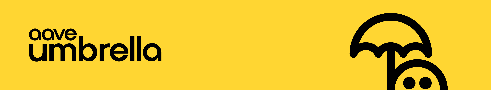

# Aave Umbrella UI



<br>

The Aave Umbrella UI is a modern web application that provides a user-friendly interface for interacting with [Aave Umbrella](https://github.com/aave-dao/aave-umbrella). It allows users to view their staked tokens, claim rewards, and manage their positions across multiple blockchain networks.

## Features

- **Staking**: basic supply, withdraw and cooldown from/to Umbrella StakeTokens
- **Claiming Rewards**: Easily claim rewards across different assets
- **Yield Analytics**: View aggregated realtime information about net yield and rewards

## Technology Stack

The application is built using the following technologies:

- **Frontend Framework**: [Next.js 15](https://nextjs.org/) with React 19
- **Styling**: [Tailwind CSS](https://tailwindcss.com/) with custom components
- **State Management**: [Zustand](https://github.com/pmndrs/zustand) for global state
- **Web3 Integration**: [wagmi](https://wagmi.sh/) and [viem](https://viem.sh/) for blockchain interactions
- **UI Components**: Custom components with [Radix UI](https://www.radix-ui.com/) primitives
- **Data Fetching**: [TanStack Query](https://tanstack.com/query) for efficient data fetching and caching
- **Wallet Connection**: [RainbowKit](https://www.rainbowkit.com/) for seamless wallet integration

## Getting Started

### Installation

1. Clone the repository:

```bash
git clone https://github.com/bgd-labs/aave-umbrella-ui.git
cd aave-umbrella-ui
```

2. Install dependencies:

```bash
npm install
```

3. Set up environment variables:

Copy the `.env.example` file to `.env.local` and fill in the required RPC endpoints for each network:

```bash
cp .env.example .env.local
```

Edit the `.env.local` file to add your RPC endpoints for each supported network.

### Development

To start the development server:

```bash
npm run dev
```

The application will be available at [http://localhost:3000](http://localhost:3000).

### Tenderly Virtual Forked Network (Optional)

This project supports connecting to a Tenderly virtual forked network for development and testing purposes. For more information on how to set up and manage your Tenderly Virtual TestNet, please refer to the [Tenderly Virtual TestNets Quickstart guide](https://docs.tenderly.co/virtual-testnets/quickstart).

To enable this feature, you need to configure the following environment variables in your `.env` file:

- `NEXT_PUBLIC_TENDERLY_VNETS_ENABLED`: Set this to `true` to enable the Tenderly virtual network.
- `NEXT_PUBLIC_TENDERLY_VNET_ID`: (Optional) The chain ID of your Tenderly virtual network. Defaults to `73571`.
- `NEXT_PUBLIC_TENDERLY_VNET_RPC`: The RPC URL of your Tenderly virtual network.
- `NEXT_PUBLIC_TENDERLY_VNET_EXPLORER`: The block explorer URL for your Tenderly virtual network.

Once these variables are set, you should be able to select the "Virtual Mainnet" (or your custom network name if you changed the ID and related configurations) from the market selector in the application. This will allow you to interact with the Aave protocol on your private, forked instance of the mainnet.

Make sure your Tenderly fork is running and accessible via the RPC URL you provided.

### Building for Production

To create a production build:

```bash
npm run build
```

To start the production server:

```bash
npm run start
```

## Deploy your own Vercel instance

Deploy your own instance of the application effortlessly through Vercel by simply clicking the button below and following the guided setup process:

[](https://vercel.com/new/clone?repository-url=https%3A%2F%2Fgithub.com%2Faave-dao%2Faave-umbrella-ui)

## Project Structure

```
src/
├── abis/            # Contract ABIs
├── app/             # Next.js app directory
│   ├── components/  # Page-specific components
│   ├── stake/       # Staking functionality
│   ├── withdraw/    # Withdrawal functionality
│   └── claim-*/     # Reward claiming functionality
├── components/      # Shared UI components
├── configs/         # Configuration files
├── constants/       # Application constants
├── hooks/           # Custom React hooks
├── mutations/       # TanStack Query mutations
├── providers/       # React context providers
├── queries/         # TanStack Query queries
├── store/           # Zustand store definitions
├── types/           # TypeScript type definitions
└── utils/           # Utility functions
```

## License

Copyright © 2025, Aave DAO, represented by its governance smart contracts.

Created by [BGD Labs](https://bgdlabs.com/).

The default license of this repository is [BUSL1.1](./LICENSE).

**IMPORTANT**. The BUSL1.1 license of this repository allows for any usage of the software, if respecting the _Additional Use Grant_ limitations, forbidding any use case damaging anyhow the Aave DAO's interests.
